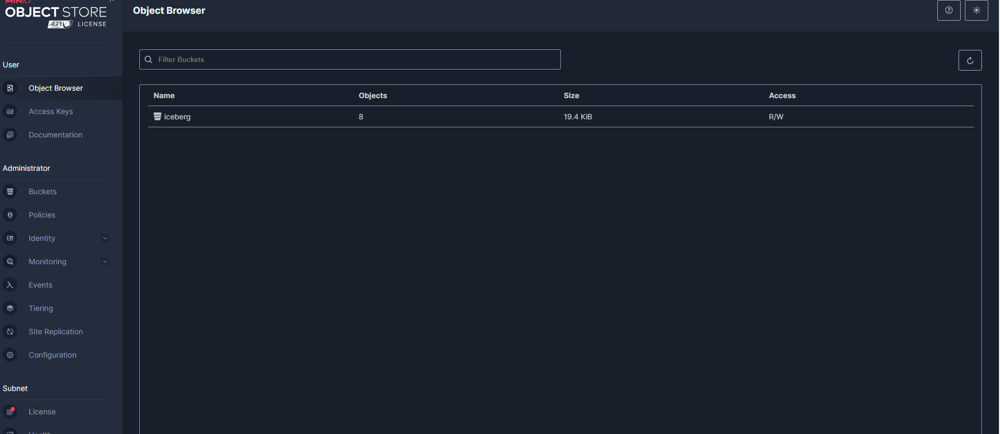

# Note 

* run `docker-compose up -d`
* dremio credentials username alessandro e psw: dremio.admin1

Configurazione connessione spark su apache airflow

minio conn config:

dremio nessie config
https://www.dremio.com/blog/intro-to-dremio-nessie-and-apache-iceberg-on-your-laptop/

